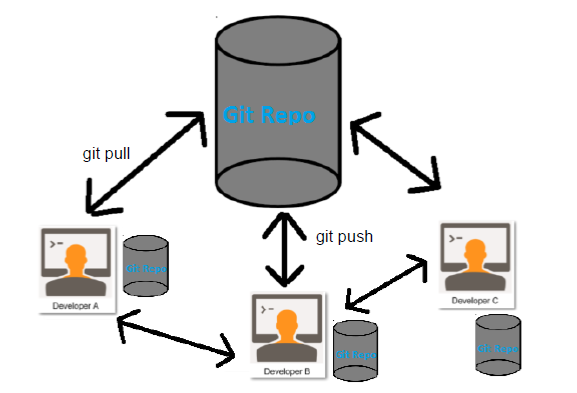

# Formation Git pour le groupe projet numériques

**Auteur : Renaud BURCK**


## Sommaire

- [Formation Git pour le groupe projet numériques](#formation-git-pour-le-groupe-projet-numériques)
  - [Sommaire](#sommaire)
  - [Git](#git)
    - [C'est quoi ?](#cest-quoi-)
    - [Pourquoi?](#pourquoi)
    - [Des limites](#des-limites)
    - [Installer Git](#installer-git)
      - [Sous Windows](#sous-windows)
      - [Sous Linux](#sous-linux)
    - [Créer un dépot local](#créer-un-dépot-local)
      - [Si vous voulez suivre les modifications de votre travail en cours](#si-vous-voulez-suivre-les-modifications-de-votre-travail-en-cours)
      - [Si vous voulez faire un répertoire qui sera partagé et sur lequel vous allez faire des opérations de type "push](#si-vous-voulez-faire-un-répertoire-qui-sera-partagé-et-sur-lequel-vous-allez-faire-des-opérations-de-type-push)


- Git :
  - cloner un dépôt  
  - créer une branche
  - faire un commit
  - faire un pull
  - faire un push
  - merger des modifications concurrentes

- Gitlab / Github :
  - Créer un dépôt
  - Faire un fork d'un dépôt
  - Faire une Merge Request

## Git


[Lien original](https://www.commitstrip.com/fr/2016/05/24/training-the-newbie/?)

### C'est quoi ?

 1. Un gestionnaire de version

    __Ce qui veut dire que l'on peut garder la chronologie des modifications__
    

 2. Décentralisé

    __On a tous une copie du dépôt et on peut continuer à enregistrer ses modifications hors connexion__

    

### Pourquoi?

L'intérêt de Git couplé à Gitlab pour notre groupe

- Partager son code source avec les autres membres de l'équipe
- Pouvoir faire tourner des scripts de tests automatique après avoir poussé chaque modification
- Rédiger un article scientifique en enregistrant les modifications au fur et à mesure
- Sauver votre travail en cas de feu


### Des limites

Git fonctionne avec les fichiers binaires de grande taille mais il vaut mieux travailler avec des fichiers textes.

### Installer Git

#### Sous Windows 

Il faut télécharger l'installeur sur [https://git-scm.com/download/win](https://git-scm.com/download/win) et faire **Suivant** à chaque page

#### Sous Linux

On prend son gestionnaire de paquet préféré et on choisit le paquet git ! Au cas où [Lien Unix](https://git-scm.com/download/linux)

### Créer un dépot local

#### Si vous voulez suivre les modifications de votre travail en cours

Dans ce répertoire les fichiers seront éditables

````bash
    cd mon/repertoire/à/suivre
    git init .
````

#### Si vous voulez faire un répertoire qui sera partagé et sur lequel vous allez faire des opérations de type "push

````bash
    cd mon/repertoire/à/suivre
    git init --bare .
````
