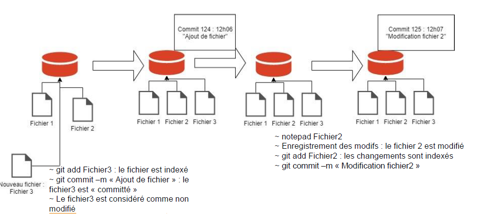
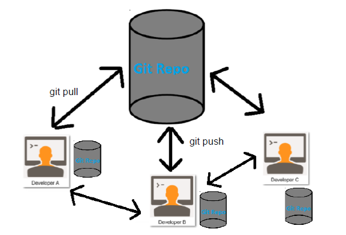
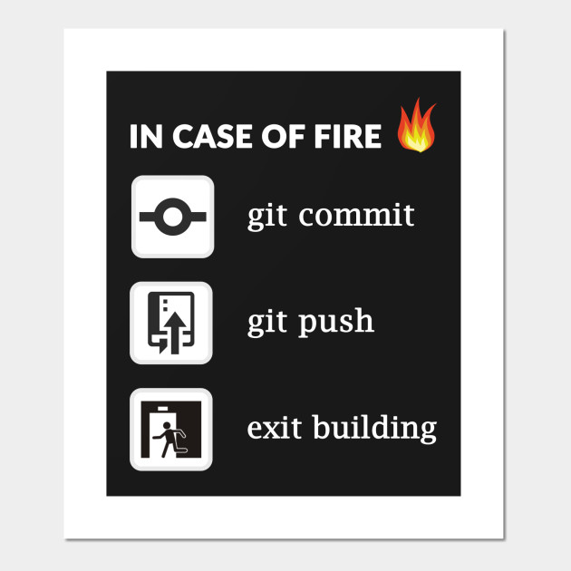
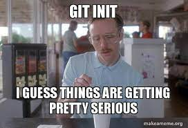
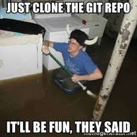

# Formation Git pour le groupe projet numériques

**Auteur : Renaud BURCK**


## Sommaire

- [Formation Git pour le groupe projet numériques](#formation-git-pour-le-groupe-projet-numériques)
  - [Sommaire](#sommaire)
  - [Git](#git)
    - [C'est quoi ?](#cest-quoi-)
    - [Pourquoi?](#pourquoi)
    - [Des limites](#des-limites)
    - [Installer Git](#installer-git)
      - [Sous Windows](#sous-windows)
      - [Sous Linux](#sous-linux)
      - [Configuration rapide](#configuration-rapide)
    - [Créer un dépôt local](#créer-un-dépôt-local)
      - [Si vous voulez suivre les modifications de votre travail en cours](#si-vous-voulez-suivre-les-modifications-de-votre-travail-en-cours)
      - [Si vous voulez faire un répertoire qui sera partagé et sur lequel vous allez faire des opérations de type "push](#si-vous-voulez-faire-un-répertoire-qui-sera-partagé-et-sur-lequel-vous-allez-faire-des-opérations-de-type-push)
      - [Répertoire .git](#répertoire-git)
    - [Cloner un dépôt](#cloner-un-dépôt)
  - [Crédits](#crédits)

- Git :
  - cloner un dépôt  
  - créer une branche
  - faire un commit
  - faire un pull
  - faire un push
  - merger des modifications concurrentes

- Gitlab / Github :
  - Créer un dépôt
  - Faire un fork d'un dépôt
  - Faire une Merge Request

## Git


[Lien original](https://www.commitstrip.com/fr/2016/05/24/training-the-newbie/?)

### C'est quoi ?

 1. Un gestionnaire de version

    __Ce qui veut dire que l'on peut garder la chronologie des modifications__
    

 2. Décentralisé

    __On a tous une copie du dépôt et on peut continuer à enregistrer ses modifications hors connexion__

    

### Pourquoi?

L'intérêt de Git couplé à Gitlab pour notre groupe

- Partager son code source avec les autres membres de l'équipe
- Pouvoir faire tourner des scripts de tests automatique après avoir poussé chaque modification
- Rédiger un article scientifique en enregistrant les modifications au fur et à mesure
- Sauver votre travail en cas de feu



### Des limites

Git fonctionne avec les fichiers binaires de grande taille mais il vaut mieux travailler avec des fichiers textes.

### Installer Git

#### Sous Windows

Il faut télécharger l'installeur sur [https://git-scm.com/download/win](https://git-scm.com/download/win) et faire **Suivant** à chaque page

#### Sous Linux

On prend son gestionnaire de paquet préféré et on choisit le paquet git ! Au cas où [Lien Unix](https://git-scm.com/download/linux)

#### Configuration rapide 

1. Configuration de votre identité
   1. git config --global user.name "John Doe"
   2. git config --global user.email johndoe@example.com
2. Configuration du proxy
   1. git config --global http.proxy http://direct.proxy.i2:8080 // Si vous êtes au bureau
   2. git config --global --unset http.proxy // Si vous êtes à la maison

### Créer un dépôt local



#### Si vous voulez suivre les modifications de votre travail en cours

Dans ce répertoire, les fichiers seront éditables

````bash
    cd mon/repertoire/à/suivre
    git init .
````

#### Si vous voulez faire un répertoire qui sera partagé et sur lequel vous allez faire des opérations de type "push

Les fichiers ne pourront pas être édités. Cela sert principalement si vous voulez créer un dépôt distant centralisé.

````bash
    cd mon/repertoire/à/suivre
    git init --bare .
````

#### Répertoire .git

Les deux commandes vont créer un répertoire nommé '.git'. C'est le répertoire qui va stocker quasiment tout ce que Git stocke et manipule.

### Cloner un dépôt



````bash
    cd mon/repertoire/ou/mettre/les/fichiers
    git clone adresse_du_dépôt
````

Un sous-répertoire va être créé avec le nom court du dépôt et il contiendra tous les fichiers clonés ainsi que le répertoire .git


*Exercice*

- Cloner le dépot de la formation avec l'adresse 2 si vous avez un compte sinon sur l'adresse 1
  - adresse 1 : [https://github.com/RenaudBCEREMA/gpn-gitlearn](https://github.com/RenaudBCEREMA/gpn-gitlearn)
  - adresse 2 : Gitlab CEREMA  A FAIRE !!!!!!!!!!!!!!!!!!!!!!!!!


## Crédits

Les crédits pour les images sont inclus dans le fichier Markdown de source.
Beaucoup de ressources sont extraites du livre "Pro Git" qui est mis à disposition sur [Git SCM](https://git-scm.com/book/fr/v2)
