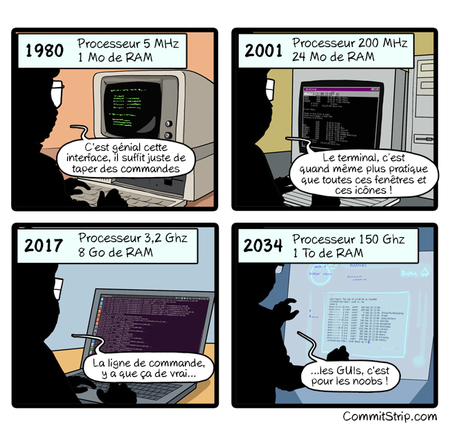

# Formation Git pour le groupe projet numériques

**Auteur : Renaud BURCK**


## Sommaire

- [Formation Git pour le groupe projet numériques](#formation-git-pour-le-groupe-projet-numériques)
  - [Sommaire](#sommaire)
  - [Petite introduction sur la session](#petite-introduction-sur-la-session)
  - [Git](#git)
    - [C'est quoi ?](#cest-quoi-)
    - [Pourquoi?](#pourquoi)
    - [Des limites](#des-limites)
    - [Installer Git](#installer-git)
      - [Sous Windows](#sous-windows)
      - [Sous Linux](#sous-linux)
      - [Configuration rapide](#configuration-rapide)
    - [Créer un dépôt local](#créer-un-dépôt-local)
      - [Si vous voulez suivre les modifications de votre travail en cours](#si-vous-voulez-suivre-les-modifications-de-votre-travail-en-cours)
      - [Si vous voulez faire un répertoire qui sera partagé et sur lequel vous allez faire des opérations de type "push](#si-vous-voulez-faire-un-répertoire-qui-sera-partagé-et-sur-lequel-vous-allez-faire-des-opérations-de-type-push)
      - [Répertoire .git](#répertoire-git)
    - [Cloner un dépôt](#cloner-un-dépôt)
      - [Exercice](#exercice)
    - [Créer une branche](#créer-une-branche)
      - [Pourquoi faire des branches ?](#pourquoi-faire-des-branches-)
      - [Commandes](#commandes)
      - [Exercice](#exercice-1)
    - [Faire des modifications et les enregistrer](#faire-des-modifications-et-les-enregistrer)
      - [Statut d'un fichier](#statut-dun-fichier)
      - [Exercice](#exercice-2)
    - [Envoyer ses modifications au dépôt distant](#envoyer-ses-modifications-au-dépôt-distant)
      - [Exercice](#exercice-3)
    - [Récupérer des modifications depuis le dépôt distant](#récupérer-des-modifications-depuis-le-dépôt-distant)
      - [Exercice](#exercice-4)
  - [A traiter plus tard](#a-traiter-plus-tard)
  - [Crédits](#crédits)

- Git :
  - merger des modifications concurrentes

- Gitlab / Github :
  - Créer un dépôt
  - Faire un fork d'un dépôt
  - Faire une Merge Request

## Petite introduction sur la session

1. L'ensemble de la démonstration est basée sur les lignes de commandes Git



2. Il y a des exercices à faire au cours de la session. Quand vous avez fini, mettre "nom_exercice plateforme fini" dans le chat ( ex : git_pull github fini)

## Git


[Lien original](https://www.commitstrip.com/fr/2016/05/24/training-the-newbie/?)

### C'est quoi ?

 1. Un gestionnaire de version

    __Ce qui veut dire que l'on peut garder la chronologie des modifications__
    

 2. Décentralisé

    __On a tous une copie du dépôt et on peut continuer à enregistrer ses modifications hors connexion__

    

    __On peut aussi les partager avec les autres directement sans passer par le dépôt distant__

### Pourquoi?

L'intérêt de Git couplé à Gitlab pour notre groupe

- Partager son code source avec les autres membres de l'équipe
- Pouvoir faire tourner des scripts de tests automatique après avoir poussé chaque modification
- Rédiger un article scientifique en enregistrant les modifications au fur et à mesure
- Sauver votre travail en cas de feu


### Des limites

Git fonctionne avec les fichiers binaires de grande taille mais il vaut mieux travailler avec des fichiers textes.

### Installer Git

#### Sous Windows

Il faut télécharger l'installeur sur [https://git-scm.com/download/win](https://git-scm.com/download/win) et faire **Suivant** à chaque page

#### Sous Linux

On prend son gestionnaire de paquet préféré et on choisit le paquet git ! Au cas où [Lien Unix](https://git-scm.com/download/linux)

#### Configuration rapide 

1. Configuration de votre identité
   1. git config --global user.name "John Doe"
   2. git config --global user.email johndoe@example.com
2. Configuration du proxy
   1. git config --global http.proxy http://direct.proxy.i2:8080 // Si vous êtes au bureau
   2. git config --global --unset http.proxy // Si vous êtes à la maison

### Créer un dépôt local


#### Si vous voulez suivre les modifications de votre travail en cours

Dans ce répertoire, les fichiers seront éditables

````bash
    cd mon/repertoire/à/suivre
    git init .
````

#### Si vous voulez faire un répertoire qui sera partagé et sur lequel vous allez faire des opérations de type "push

Les fichiers ne pourront pas être édités. Cela sert principalement si vous voulez créer un dépôt distant centralisé.

````bash
    cd mon/repertoire/à/suivre
    git init --bare .
````

#### Répertoire .git

Les deux commandes vont créer un répertoire nommé '.git'. C'est le répertoire qui va stocker quasiment tout ce que Git stocke et manipule.

### Cloner un dépôt


````bash
    cd mon/repertoire/ou/mettre/les/fichiers
    git clone adresse_du_dépôt
````

Un sous-répertoire va être créé avec le nom court du dépôt et il contiendra tous les fichiers clonés ainsi que le répertoire .git

#### Exercice

- Cloner le dépot de la formation avec l'adresse 2 si vous avez un compte sinon sur l'adresse 1
  - adresse 1 : [https://github.com/RenaudBCEREMA/gpn-gitlearn](https://github.com/RenaudBCEREMA/gpn-gitlearn)
  - adresse 2 : Gitlab CEREMA  A FAIRE !!!!!!!!!!!!!!!!!!!!!!!!!

### Créer une branche


#### Pourquoi faire des branches ?

Les branches sont un moyen efficaces de faire des modifications sur des fichiers sans casser le fonctionnement principal de notre application

#### Commandes

````bash
    # dans le répertoire du projet git

    ## lister les branches
    git branch # rajouter -v si vous voulez le texte du dernier commit sur la branche

    # créer une branche
    git checkout -b nom_de_ma_branche

    # Supprimer une branche
    git branch -d nom_de_la_branche_a_supprimer
````

#### Exercice

Créer une branche à son nom depuis la branche dev

### Faire des modifications et les enregistrer

#### Statut d'un fichier

Non suivi : Le fichier est présent dans le répertoire mais n'est pas ajouté à l'index git.
Non modifié : Le fichier est dans le répertoire et ajouté à l'index avec la commande git add. Si des changements ont été faits, ils n'ont pas été suivis. C'est aussi le statut des fichiers après un enregistrement dans le dépôt.
Modified state : Le fichier suivi a été édité mais les changements n'ont pas été enregistrés dans le dépôt git.
Staged state : Le fichier a été enregistré dans le dépôt git et est prêt à être envoyés sur le dépôt.


````bash
    # création d'un fichier texte quelconque
    touch text.txt

    #Ajout du fichier à l'index
    git add ./test.txt

    #On regarde les modifications du dépôt le fichier est indiqué comme nouveau
    git status

    #Editer le fichier et ajouter du contenu
    notepad ./test.txt

    #On regarde les modifications du dépôt le fichier est indiqué comme nouveau et édité
    git status

    # On enregistre les modifications dans le dépôt local
    git commit -m "Ajout et édition du fichier test.txt"

    #On regarde les modifications du dépôt le fichier n'est plus dans la liste
    git status
    
````

#### Exercice

Ajouter un fichier quelconque nommé mon_nom.txt à son dépôt
Faire quelques modifications dans ce fichier
 et le "commité"


### Envoyer ses modifications au dépôt distant


Plus sérieusement, je préconise des commits très réguliers ( dès qu'on a finit d'écrire sa fonction / son paragraphe par exemple) et des pushs quotidiennement

Cela permet d'avoir des commits qui ont un impact limité et sur lesquels on peut revenir rapidement. Cela force aussi à décrire ce que l'on fait très souvent et cela permet la compréhension du travail réalisé lors qu'une autre personne va relire votre description de commit. (NB c'est important et vous verrez pourquoi).

Les pushs quotidiens permettent de limiter le nombre d'envoi au dépôt distant et permettent par exemple de faire un cylce de travail en équipe du genre :

1. le matin, je relis les commits de mes collègues pour voir si cela impacte mon code
2. dans la journée, je fais mes modifications
3. le soir je pousse mes modifications

````bash
    # Pousser ses modifications
    git push

    # Si la branche n'existe pas sur le dépôt distant.
    git push --set-upstream origin/nom_de_ma_branche
````

#### Exercice

Pousser ses derniers commits sur le dépôt distant

### Récupérer des modifications depuis le dépôt distant

Lorsque l'on collabore a plusieurs, il faut évidemment récupérer les modifications des autres 


````bash
    # Voir ce qui a été modifié
    git fetch
    git diff ..origin/nom_de_ma_branche

    # Récupérer les changements
    git pull
````

#### Exercice

Récupérer les dernière modifications sur la branche dev distante et mettre à jour votre branche dev distante

### Un essai

## A traiter plus tard

 1. cherry-pick
 2. partage sans dépôt distant
 3. CI/CD

## Crédits

1. Les crédits pour les images sont inclus dans le fichier Markdown de source.
2. Beaucoup de ressources sont extraites du livre "Pro Git" qui est mis à disposition sur [Git SCM](https://git-scm.com/book/fr/v2)
3. [Article sur les statuts des fichiers dans Git](https://shitalmule04.github.io/file-status-lifecycle-in-git.html)
